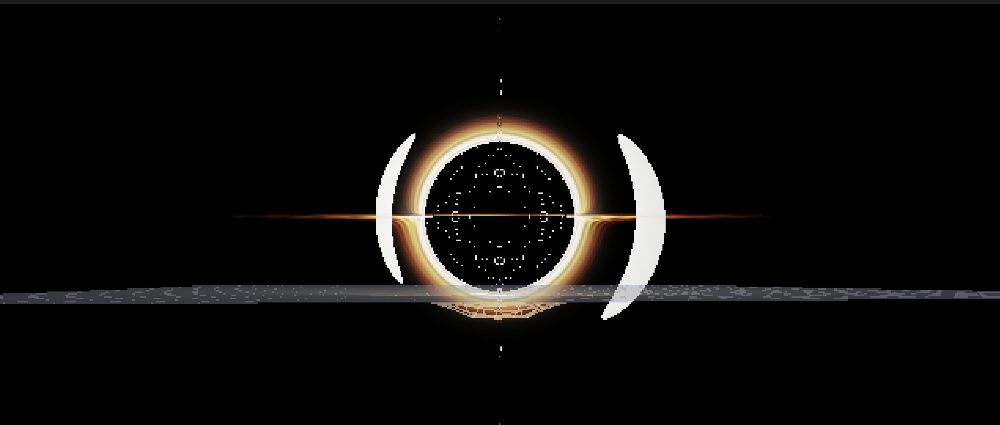
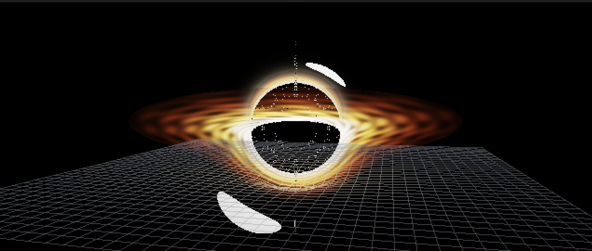

# BlackHole

Simulateur de trou noir en temps réel, inspiré d'*Interstellar*. Ray tracing GPU via Metal, physique basée sur les géodésiques de Schwarzschild intégrées en RK4.

---

## Screenshots



*Vue équatoriale : anneau d'Einstein, disque d'accrétion et étoile compagne en orbite.*



*Vue en perspective : grille de courbure espace-temps (touche `G`) et lentille gravitationnelle.*

---

## Architecture

```
BlackHole/
├── src/
│   ├── main.mm          # Fenêtre Cocoa, boucle de rendu, gestion trackpad
│   ├── renderer.mm/.hpp # Pipeline Metal compute + composite
│   ├── geodesics.cpp/.hpp # Intégrateur RK4 des géodésiques nulles (Schwarzschild)
│   ├── camera.hpp       # Caméra orbitale sphérique
│   └── grid.hpp         # Grille de courbure espace-temps (Metal render pipeline)
└── shaders/
    └── blackhole.metal  # Shader compute : ray marching + disque d'accrétion + étoile
```

## Physique

- **Métrique de Schwarzschild** — géodésiques nulles (photons) en coordonnées sphériques
- **Intégrateur RK4** — Runge-Kutta 4 pour la trajectoire des rayons lumineux
- **Potentiel effectif** — calcul via `V_eff = (1 - 2M/r)(1 + L²/r²sin²θ)`
- **Rayon de Schwarzschild** — `rs = 2M` (unités géométriques, G = c = 1)
- **Disque d'accrétion** — anneau entre `r = 2.6` (ISCO) et `r = 12` (unités M)
- **Étoile compagne** — orbite équatoriale à `r = 28`, période ~52 s

## Rendu

- **Ray marching GPU** — shader compute Metal, un thread par pixel
- **Lentille gravitationnelle** — déviation des rayons autour de l'horizon des événements
- **Anneau d'Einstein** — image secondaire du disque visible au-dessus et en dessous
- **Grille espace-temps** — déformation newtonienne approchée `y = -rs/r`, rendu en alpha-blend
- **Upscaling nearest-neighbor** — rendu à basse résolution (640×360) upscalé via `CAMetalLayer`

## Build & lancement

**Prérequis** : macOS, Xcode (avec outils Metal), CMake ≥ 3.20.

```bash
cmake -S . -B build && cmake --build build && ./build/BlackHole
```

Le `.metallib` est compilé automatiquement et copié à côté de l'exécutable.

## Contrôles

| Action | Geste |
|---|---|
| Orbite | Clic gauche + drag |
| Zoom | Pinch trackpad ou scroll deux doigts |
| Grille espace-temps | Touche `G` |

## Résolution

La résolution de rendu GPU est configurable dans `src/main.mm` :

| Mode | Résolution |
|---|---|
| Moyenne (défaut) | 640 × 360 |
| Pixelisé | 480 × 270 |
| GPU minimal | 320 × 180 |

La fenêtre d'affichage reste à 1280 × 720 — le upscaling est géré par Core Animation en nearest-neighbor.
